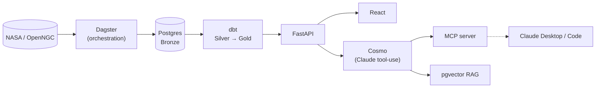

# CosmiDex 🌌

**A Pokédex for the cosmos.**

CosmiDex turns real astronomical data into something you can actually explore — a
Pokédex-style catalog for cosmic entities, each with its own interactive cards,
AI-generated artwork, and an AI chat assistant that answers questions grounded in the
real underlying data instead of guessing.

Exoplanets are live today: NASA's confirmed exoplanet catalog, filtered to potentially
habitable worlds, each with physical/orbital/stellar stats, a calculated habitability
score, AI-generated artwork, and an experiential description. Galaxies, Solar System,
and more are in active development, following the same pipeline.

---

## What it does

- Displays potentially habitable exoplanets from NASA's Exoplanet Archive as
  interactive cards — physical properties, orbital mechanics, host star data, and a
  calculated Earth Similarity Index / habitability tier
- Generates AI artwork and experiential descriptions for every displayed planet
- **Cosmo** — an in-app AI chat assistant (Claude's tool-use API) that can look up,
  search, and compare planets, and answer conceptual space questions via a
  Retrieval-Augmented Generation layer over real reference articles
- A standalone **MCP server**, so the same structured query tools also work in
  external clients like Claude Desktop and Claude Code, not just the web app

## Stack

| Layer | Technology |
|---|---|
| Raw data | NASA Exoplanet Archive (TAP service), OpenNGC |
| Orchestration | Dagster |
| Database | PostgreSQL (+ pgvector for RAG) |
| Transformation | dbt (Bronze → Silver → Gold) |
| API | FastAPI |
| Frontend | React + Vite |
| AI chat | Claude API (tool-use) + a custom MCP server |
| Images / descriptions | Google Gemini |
| Infra (planned) | Terraform, AWS (EC2 + ECS + S3 + CloudFront), GitHub Actions CI/CD |

## Architecture



Deliberately cost-conscious for a self-funded solo project — self-hosted Postgres
alongside the API on a single EC2 instance, no NAT Gateway, no RDS — while still
following real production practices: infrastructure as code (Terraform), containerized
deployment (Docker), and CI/CD (GitHub Actions).

## Project status

**Done**
- Exoplanet data pipeline (Dagster → Postgres → dbt → FastAPI → React)
- AI-generated artwork and descriptions for all displayed planets
- Cosmo, the in-app chat assistant, with MCP tools (lookup / search / compare) and a
  RAG layer over real reference articles
- Standalone MCP server, usable by external MCP clients

**In progress**
- Galaxies entity (Messier catalog subset, real NASA imagery instead of AI-generated art)
- Solar System entity

**Planned**
- Black Holes, Nebulae, Comets & Asteroids, Stars, Neutron Stars
- AWS deployment (Terraform, ECS, S3/CloudFront, Dagster Cloud)
- CI/CD via GitHub Actions

## Project layout

```
cosmidex_pipeline/   Dagster project — ingestion, validation, Bronze load
cosmidex_dbt/        dbt project — Silver/Gold transformations
cosmidex_api/        FastAPI backend
cosmidex_mcp/        Standalone MCP server (shared tool logic with the chat API)
cosmidex_frontend/   React + Vite frontend
sql/                 Raw SQL migrations
```

---

Built by [Zac Cheatle](https://www.linkedin.com/in/zaccheatle/).
